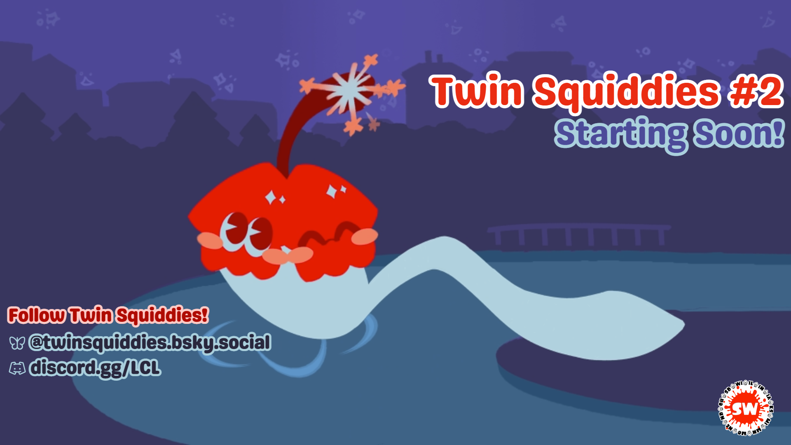
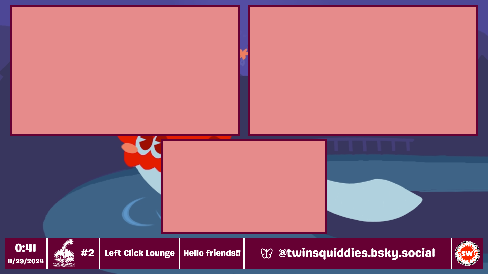
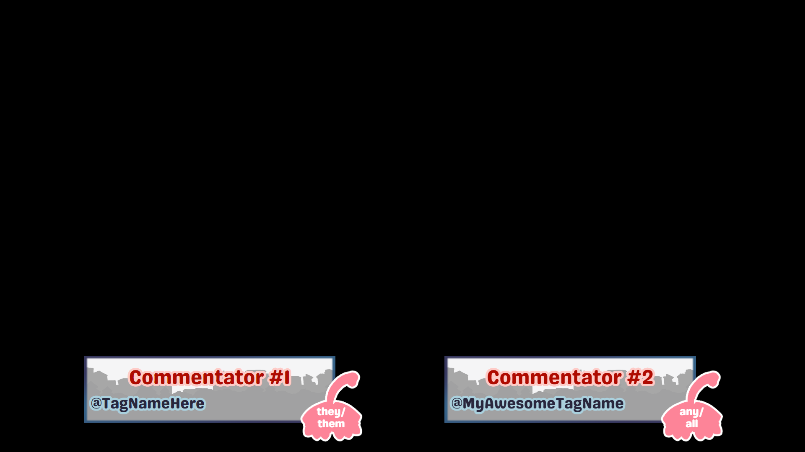

# twinsquiddies-layouts

twinsquiddies-layouts is a [NodeCG](http://github.com/nodecg/nodecg) bundle made for [Twin Squiddies](https://bsky.app/profile/twinsquiddies.bsky.social), a Minneapolis-based Splatoon LAN, in association with [SquidWest](https://bsky.app/profile/squidwest.bsky.social).

This repository contains the associated event graphics and must be used in tandem with [squidwest-layout-controls](https://github.com/EpicYoshiMaster/squidwest-layout-controls).

The graphics included are:

- Starting Soon scene
- Be Right Back scene
- Commentary Lower Thirds
- Omnibar
- Three Screen Intermission
- Credits sequence

The break screen artwork was made by [Lilalychi](https://bsky.app/profile/lilalychi.bsky.social).

## Images

## Install

1. Complete the steps to obtain [NodeCG](https://www.nodecg.dev/) and [nodecg-cli](https://github.com/nodecg/nodecg-cli).

2. Install the bundle: `nodecg install EpicYoshiMaster/twinsquiddies-layouts`.

## Support

If you like the things I make, consider supporting me on my ko-fi page: [https://ko-fi.com/epicyoshimaster](https://ko-fi.com/epicyoshimaster)!